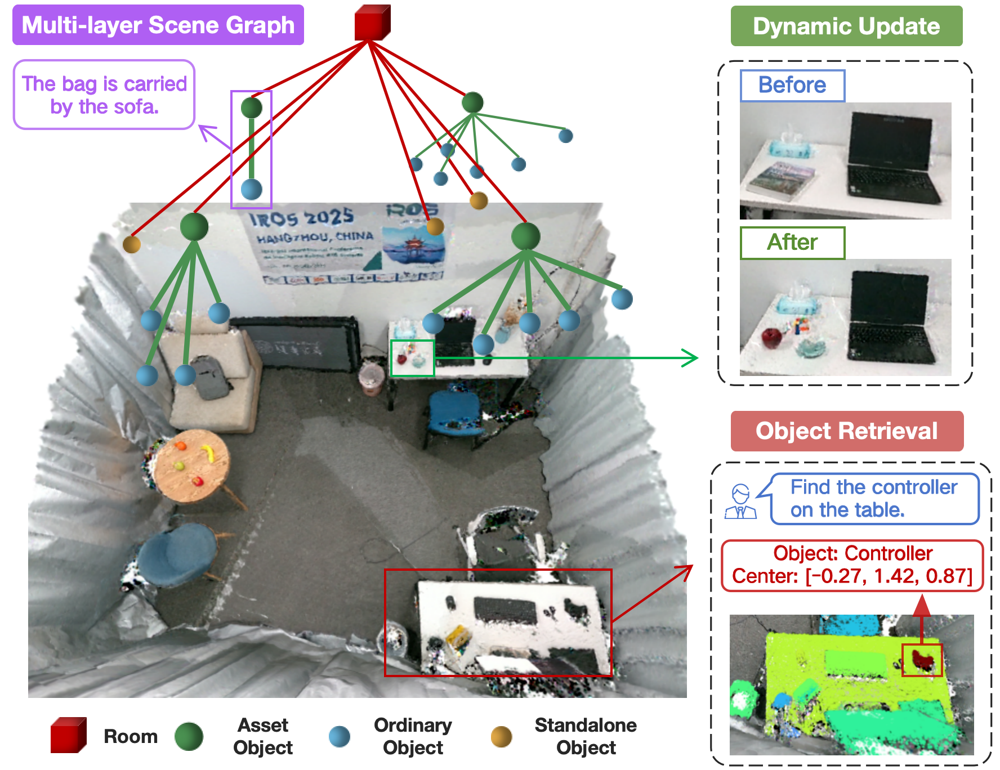

<p align="center">

  <h1 align="center">DynamicGSG: Dynamic 3D Gaussian Scene Graphs for Environment Adaptation</h1>
  <h3 align="center"></h3>
  <p align="center">
    <strong>Luzhou Ge</strong>
    ·
    <strong>Xiangyu Zhu</strong>
    ·
    <strong>Zhuo Yang</strong>
    ·
    <strong>Xuesong Li</strong>
  </p>
  <p align="center">
    <strong>Beijing Institute of Technology</strong>
  </p>
  <h3 align="center"><a href="https://arxiv.org/abs/2502.15309">Paper</a> | <a href="https://youtu.be/9QftApGbcSA">Video</a>| <a href="https://youtu.be/9QftApGbcSA">Supplementary Materials</a> </h3>
  <div align="center"></div>
</p>
<p align="center">
  <a href="">
    
  </a>
</p>

## Dynamic Update Demo
<p align="center">
  
  
</p>


### Overview

> In real-world scenarios, environment changes caused by human or agent activities make it extremely challenging for robots to perform various long-term tasks. Recent works typically struggle to effectively understand and adapt to dynamic environments due to the inability to update their environment representations in memory according to environment changes and lack of fine-grained reconstruction of the environments. To address these challenges, we propose \textit{DynamicGSG}, a dynamic, high-fidelity, open-vocabulary scene graph construction system leveraging Gaussian splatting. \textit{DynamicGSG} builds hierarchical scene graphs using advanced vision language models to represent the spatial and semantic relationships between objects in the environments, utilizes a joint feature loss we designed to supervise Gaussian instance grouping while optimizing the Gaussian maps, and locally updates the Gaussian scene graphs according to real environment changes for long-term environment adaptation. Experiments and ablation studies demonstrate the performance and efficacy of our proposed method in terms of semantic segmentation, language-guided object retrieval, and reconstruction quality. Furthermore, we validate the dynamic updating capabilities of our system in real laboratory environments.

### Installation


### TODO List
- [ ]  Realese supplementary experimental materials of Language-guided Object Retrieval on the Replica dataset.

If our work is successfully accepted：

- [ ]  Update detailed tutorial and code for DynamicGSG.
- [ ]  Open source deployment code using realsense d455.


### Acknowledgement

This work is built on many amazing research works and open-source projects, thanks a lot to all the authors for sharing!
- [SplaTAM](https://github.com/spla-tam/SplaTAM)
- [ConceptGraphs](https://github.com/concept-graphs/concept-graphs)
- [Vins-Fusion](https://github.com/HKUST-Aerial-Robotics/VINS-Fusion)

### Citation
If you find our paper and code useful, please cite us:
```bibtex
@misc{ge2025dynamicgsgdynamic3dgaussian,
      title={DynamicGSG: Dynamic 3D Gaussian Scene Graphs for Environment Adaptation}, 
      author={Luzhou Ge and Xiangyu Zhu and Zhuo Yang and Xuesong Li},
      year={2025},
      eprint={2502.15309},
      archivePrefix={arXiv},
      primaryClass={cs.RO},
      url={https://arxiv.org/abs/2502.15309}, 
}
```
